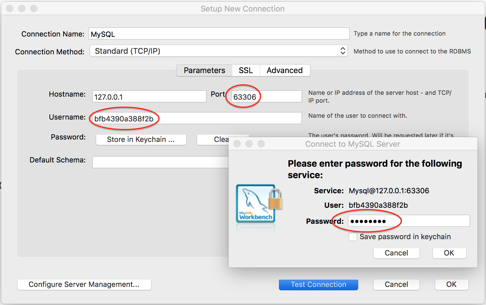

# SQLTunnel

## What?

It's nothing special whatsoever, just a tiny app with the sole purpose of providing a bridge for accessing back end services in Cloud Foundry just as if they were locally hosted.

For instance this allows us to connect fully featured UI tools like [MySQL Workbench](https://www.mysql.com/products/workbench/) to a MySQL database residing inside Cloud Foundry.  Without this bridging technique, we're restricted to the using the MySQL CLI tool.

## Why?

Because ...

* `cf create-service-key` is a fancy way of inspecting fragments of what might appear in the `VCAP_SERVICES` environment variable without having to physically bind an app to a service.

* Our real business apps are supposed to be immutable so what business do we have hijacking a `cf ssh` call just to interfere with the port mappings inside our container?

* Basically, these [instructions](https://docs.cloudfoundry.org/devguide/deploy-apps/ssh-services.html) feel a bit overkill.

Instead, let's have a pointless, tiny NodeJS web app for arbitrary service bindings which simply publishes the value of `VCAP_SERVICES` as a web page and is specifically designed for `cf ssh` port bind hijacks.

## How?

Assuming you're already logged onto PWS, you can use the following instrcutions:

```
git clone https://github.com/amcginlay/sqltunnel.git
cd sqltunnel && cf push                # NOTE we're using a CF manifest file
cf create-service cleardb spark mysql  # replace "cleardb spark" with "p-mysql 100mb" when targeting PCF
cf bind-service sqltunnel mysql
cf env sqltunnel                       # NOTE the VCAP_SERVICES JSON object value
```

From the `VCAP_SERVICES` environment variable you can identify `cleardb` values for `name`, `hostname`, `username` and `password` within the JSON object.  NOTE `name` indicates the identifier of the database Cloud Foundry generated for you.

Now we can use `cf ssh` to hijack (or leech off) the SQLTunnel app, thereby bridging the internal and external networks and exposing the MySQL service instance on a local port.

```
cf ssh -L 63306:[hostname]:[port] sqltunnel
```

You'll know this call worked if you get back a `vcap@xyz` command prompt.  Don't `exit` from this prompt whilst you need SQL access.

Now fire up MySQL Workbench and connect to the localhost using the values you identified from the SQLTunnel web page above.



### Task Complete!


